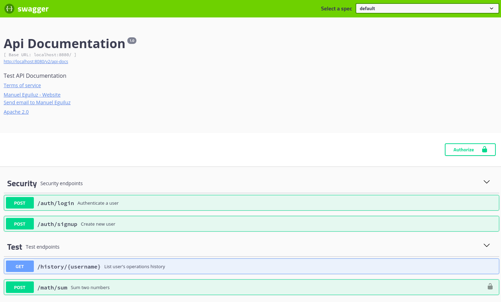
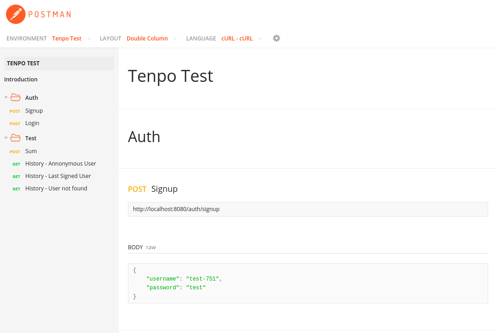

# tenpo challenge

[Tenpo](https://www.tenpo.cl/) technical challenge.

## 1. Features

- Sign in
- Log in with jwt
- User's operations navigation history.
- Secured sum

## 2. How to run

A. Start application using [docker compose](https://docs.docker.com/compose/install/).

`docker-compose up`

This will download the required docker images, create containers, and run the application in their required environment.

B. Test API endpoints

After you have run the application and their environment, you can test application endpoints using swagger-ui and postman following the their links.

[Swagger UI](http://localhost:8080/swagger-ui.html)

[Postman](https://documenter.getpostman.com/view/1709394/TVes6mTR)

